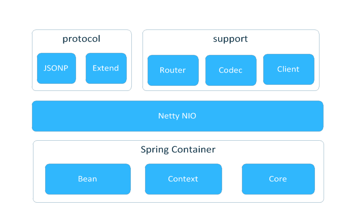

#lamp
>基于netty&spring容器封装的json通讯协议组件

##modules

##protocol
>现仅支持私有JSONP协议
>TODO 自定义协议扩展，开放解包封包实现


###JSONP实现
RequestJSON
``` json
{
	"id": 0,
	"uri": "/lamp/test",
	"data": {
		"name": "dempe"
	}
}
```
- id： 消息序列号，用户标志消息
- uri：消息uri,用户路由到对应业务
- data: 请求参数json

ResponseJSON
``` json
{
	"id": 0,
	"uri": "/lamp/test",
	"data": {
		"data": "6666"
	}

}
```
- id： 消息序列号，用户标志消息
- uri：消息uri,对应请求uri
- data: 返回结果


##example
###服务端的打开方式
####基于spring注解的打开方式
``` java
@Configuration
@ComponentScan
public class LampServer {

    public static void main(String[] args) {
        ApplicationContext context = new AnnotationConfigApplicationContext(LampServer.class);
        BaseServer baseServer = new BaseServer(DefConfigFactory.createDEVConfig(), context);
        baseServer.start();
    }
}
```
####基于spring xml的打开方式
``` java
 ApplicationContext context = new ClassPathXmlApplicationContext(new String[]{"application.xml"});
        BaseServer baseServer = new BaseServer(DefConfigFactory.createDEVConfig(), context);
        baseServer.start();
```
application.xml配置如下
``` xml
<?xml version="1.0" encoding="UTF-8"?>
<beans xmlns="http://www.springframework.org/schema/beans"
       xmlns:xsi="http://www.w3.org/2001/XMLSchema-instance"
       xmlns:context="http://www.springframework.org/schema/context"
       xsi:schemaLocation="http://www.springframework.org/schema/beans
        http://www.springframework.org/schema/beans/spring-beans.xsd
        http://www.springframework.org/schema/context
        http://www.springframework.org/schema/context/spring-context.xsd">

    <context:annotation-config/>
    <!-- 主动搜索以下目录 -->
    <context:component-scan base-package="com.dempe.lamp"/>

</beans>
```
###业务逻辑的编写方式
``` java
@Controller("lamp")
public class LampController {

    @Resource
    LampService lampService;

    @Path
    public JSONObject test(@Param String name) {
        System.out.println("name===>" + name);
        lampService.say();
        JSONObject jsonObject = new JSONObject();
        jsonObject.put("code", 6666);
        return jsonObject;
    }
}

```
###客户端的使用方式
``` java
public class LampClient {
    public static void main(String[] args) {
        ReplyClient client = new ReplyClient("localhost", 8888);
        JSONObject data = new JSONObject();
        data.put("name", "dempe");
        JSONRequest request = new JSONRequest("/lamp/test", data);
        Response response = client.sendAndWait(request);
        client.sendOnly(request);
        System.out.println(response);
    }
}

###性能测试
开发机 4核 8G win7
sendAndWait(Request req) 4w+
sendOnly(Request req)
